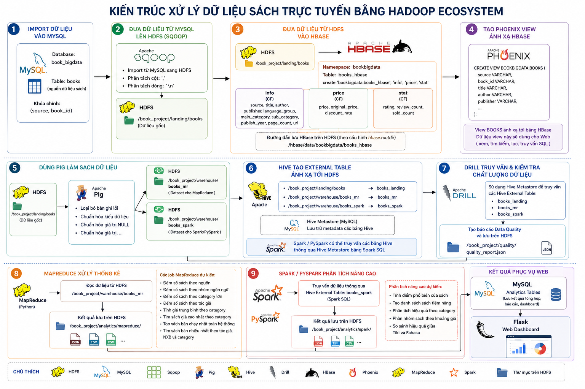
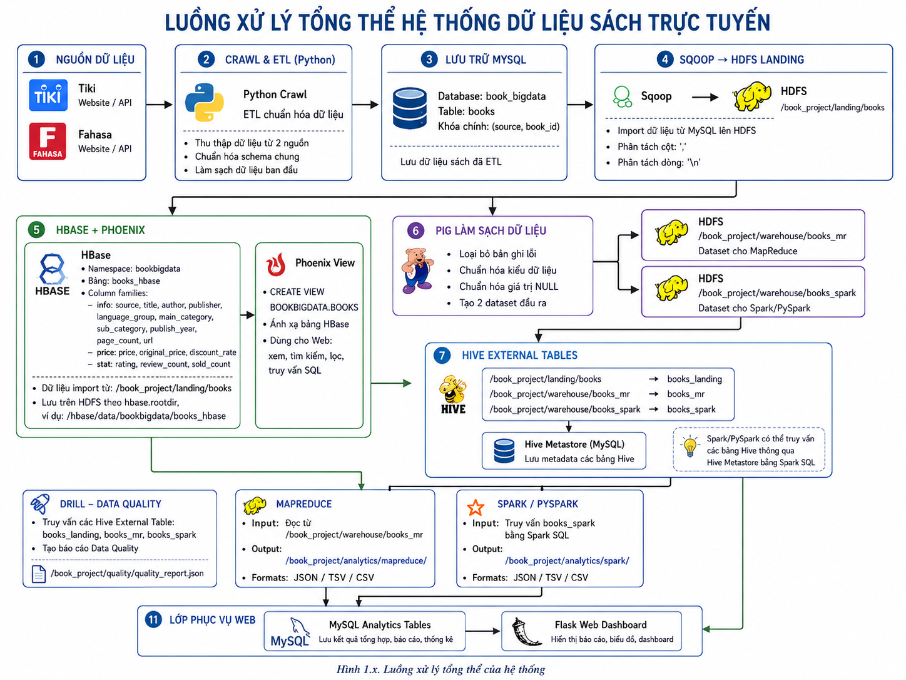

# Book Big Data Analytics System

Hệ thống thu thập, lưu trữ, xử lý và trực quan hóa dữ liệu sách từ **Tiki** và
**Fahasa** bằng Hadoop Ecosystem. Dự án mô phỏng một pipeline Big Data hoàn
chỉnh: crawl dữ liệu, chuẩn hóa, đưa vào HDFS, xử lý batch bằng MapReduce và
Spark, lưu dữ liệu phục vụ truy vấn trong HBase/Phoenix, sau đó hiển thị qua
Web Flask.

## Tổng Quan Nhanh

| Hạng mục | Mô tả |
| --- | --- |
| Mục tiêu | Xây dựng hệ thống phân tích dữ liệu sách end-to-end từ crawl đến dashboard web. |
| Nguồn dữ liệu | Tiki API/HTML và Fahasa HTML. |
| Dữ liệu chính | Thông tin sách, giá bán, giảm giá, tác giả, nhà xuất bản, category, rating, lượt bán và lượt đánh giá. |
| Xử lý dữ liệu | ETL bằng Python/Scrapy, staging MySQL, import HDFS bằng Sqoop, tiền xử lý bằng Pig/Hive. |
| Phân tích | Hadoop MapReduce cho thống kê batch; Spark/PySpark cho phân tích nâng cao. |
| Lưu trữ phục vụ Web | HBase lưu dữ liệu dạng column-family; Phoenix cung cấp SQL View để truy vấn. |
| Giao diện | Flask Web gồm dashboard, quản lý sách, SQL query, analytics, data quality và backup/restore. |
| Môi trường triển khai | WSL Ubuntu single node / pseudo-distributed Hadoop cluster. |

## Điểm Nổi Bật

- Pipeline Big Data nhiều tầng: Crawl -> ETL -> MySQL -> Sqoop -> HDFS -> Pig/Hive -> MapReduce/Spark -> HBase/Phoenix -> Flask.
- Web có thể chạy ở `mock` mode để demo giao diện nhanh, hoặc `live` mode để kết nối HBase, Phoenix và HDFS thật.
- Hỗ trợ tìm kiếm, lọc, phân trang, thêm, sửa, xóa sách thông qua Phoenix và HBase Thrift/HappyBase.
- Dashboard hiển thị kết quả phân tích từ MapReduce, Spark và báo cáo Data Quality.
- Có lớp backup/restore dữ liệu HBase bằng HBase Snapshot.

## Kiến Trúc Hệ Thống

### System Architecture



### Data Pipeline



## Cách Hệ Thống Hoạt Động

| Bước | Thành phần | Vai trò | Output chính |
| --- | --- | --- | --- |
| 1 | Scrapy Crawler | Thu thập dữ liệu sách từ Tiki và Fahasa. | Raw JSON |
| 2 | Python ETL | Chuẩn hóa schema, làm sạch dữ liệu, xử lý giá trị thiếu. | `books_clean.csv` |
| 3 | MySQL | Staging database trước khi đưa dữ liệu vào Hadoop. | Bảng `books` |
| 4 | Sqoop | Import dữ liệu từ MySQL vào HDFS. | `/book_project/landing/books` |
| 5 | Pig/Hive | Tạo dataset phục vụ MapReduce và Spark, quản lý metadata. | `books_mr`, `books_spark` |
| 6 | MapReduce | Tính thống kê batch như số sách theo nguồn, category, rating, sales. | `/book_project/analytics/mapreduce` |
| 7 | Spark/PySpark | Phân tích nâng cao như sách phổ biến, sách tiềm năng, hiệu quả category. | `/book_project/analytics/spark` |
| 8 | Drill | Kiểm tra chất lượng và đối soát dữ liệu. | `/book_project/quality/quality_report.json` |
| 9 | HBase/Phoenix | Lưu dữ liệu phục vụ truy vấn nhanh và CRUD từ Web. | `bookbigdata:books_hbase`, Phoenix View |
| 10 | Flask Web | Hiển thị dashboard, quản lý sách, truy vấn SQL, analytics và backup. | Web UI |

## Chức Năng Web

| Màn hình | Chức năng |
| --- | --- |
| Dashboard | Tổng quan số lượng sách, category, nguồn dữ liệu và trạng thái hệ thống. |
| Books | Xem danh sách sách, tìm kiếm, lọc, phân trang, thêm, sửa, xóa dữ liệu. |
| SQL Query | Chạy câu lệnh `SELECT` hoặc `EXPLAIN` trên Phoenix View. |
| Analytics | Hiển thị kết quả MapReduce và Spark từ HDFS bằng bảng và biểu đồ. |
| Data Quality | Hiển thị báo cáo kiểm tra chất lượng dữ liệu. |
| Backup | Tạo, xem, restore, clone và xóa HBase Snapshot. |

## Công Nghệ Sử Dụng

| Nhóm | Công nghệ |
| --- | --- |
| Ngôn ngữ | Python, Bash, SQL |
| Crawl/ETL | Scrapy, pandas, Python scripts |
| Web | Flask, Bootstrap, Chart.js |
| Staging | MySQL |
| Big Data Storage | HDFS, HBase |
| Hadoop Ecosystem | Hadoop, YARN, Sqoop, Pig, Hive, Drill |
| Processing | Hadoop Streaming MapReduce, Spark/PySpark |
| Query Layer | Phoenix JDBC, Phoenix SQL View |
| HBase Access | HappyBase, HBase Thrift Server |
| Environment | WSL Ubuntu single node |

## Cấu Trúc Thư Mục

```text
Book_BigDataProject/
|-- crawler_etl/          # Scrapy spider, cấu hình crawl và ETL scripts
|-- data/                 # Dữ liệu sạch hoặc dữ liệu mẫu
|-- database/             # Schema MySQL và script import staging
|-- hadoop/               # Sqoop, Pig, Hive, Drill, MapReduce, Spark, HBase, Phoenix
|-- scripts/ubuntu/       # Script chạy Spark và HBase/Phoenix trên Ubuntu/WSL
|-- web/                  # Flask app, routes, services, templates, static files
|-- images/               # Sơ đồ kiến trúc và pipeline
|-- docs/                 # Tài liệu setup chi tiết theo từng module
|-- requirements.txt
`-- .env.example
```

## Schema Dữ Liệu Chính

```text
book_id
source
title
author
publisher
language_group
main_category
sub_category
price
original_price
discount_rate
rating
review_count
sold_count
publish_year
page_count
url
```

## Dataset Và Bảng Chính

| Lớp | Tên | Mục đích |
| --- | --- | --- |
| MySQL | `books` | Bảng staging để Sqoop import lên HDFS. |
| HDFS | `/book_project/landing/books` | Dữ liệu landing sau khi import từ MySQL. |
| HDFS/Hive | `books_mr` | Dataset phục vụ Hadoop MapReduce. |
| HDFS/Hive | `books_spark` | Dataset phục vụ Spark/PySpark. |
| HDFS | `/book_project/analytics/mapreduce/*` | Output các job MapReduce. |
| HDFS | `/book_project/analytics/spark/*` | Output các job Spark. |
| HDFS | `/book_project/quality/quality_report.json` | Báo cáo Data Quality. |
| HBase | `bookbigdata:books_hbase` | Bảng NoSQL phục vụ Web CRUD. |
| Phoenix | `"bookbigdata"."books_hbase"` | Phoenix mapped View ánh xạ bảng HBase. |
| Phoenix | `BOOKBIGDATA.BOOKS` | View truy vấn thống nhất cho Flask Web. |

## Chạy Demo Web Nhanh

Chế độ này dùng dữ liệu mẫu trong code, phù hợp để HR hoặc người review xem
giao diện mà không cần cài Hadoop/HBase/Phoenix.

```powershell
copy .env.example .env
python -m venv .venv
.\.venv\Scripts\activate
python -m pip install --upgrade pip
pip install -r requirements.txt
python web/app.py
```

Mở trình duyệt:

```text
http://127.0.0.1:5000
```

Trong file `.env`, giữ cấu hình:

```env
WEB_DATA_MODE=mock
FLASK_HOST=127.0.0.1
FLASK_PORT=5000
```

## Chạy Với Dữ Liệu Thật

Khi muốn kết nối Web với HDFS, HBase và Phoenix thật, chuyển `.env` sang:

```env
WEB_DATA_MODE=live
PHOENIX_JDBC_URL=jdbc:phoenix:localhost:2181
PHOENIX_BOOKS_VIEW=BOOKBIGDATA.BOOKS
HBASE_TABLE=bookbigdata:books_hbase
HBASE_THRIFT_HOST=localhost
HDFS_NAMENODE_URL=http://localhost:9870
```

Luồng chạy tổng quát trên WSL Ubuntu:

```bash
start-dfs.sh
start-yarn.sh
start-hbase.sh
hbase-daemon.sh start thrift

PHOENIX_ZK=127.0.0.1:2181 bash scripts/ubuntu/run_hbase_phoenix.sh
bash scripts/ubuntu/run_spark.sh
python web/app.py
```

Tài liệu setup chi tiết cho từng thành phần nằm trong `docs/setup/`.

## Biến Môi Trường Quan Trọng

| Biến | Ý nghĩa |
| --- | --- |
| `WEB_DATA_MODE` | `mock` để demo UI, `live` để kết nối hệ thống thật. |
| `FLASK_HOST`, `FLASK_PORT` | Host và port chạy Flask Web. |
| `PHOENIX_JDBC_URL` | JDBC URL kết nối Phoenix. |
| `PHOENIX_JDBC_CLASSPATH` | Classpath Phoenix client, HBase config và Hadoop config. |
| `PHOENIX_BOOKS_VIEW` | View Phoenix dùng cho truy vấn Web. |
| `HBASE_TABLE` | Bảng HBase dùng cho CRUD và backup. |
| `HBASE_THRIFT_HOST`, `HBASE_THRIFT_PORT` | Kết nối HBase Thrift Server. |
| `HDFS_NAMENODE_URL` | WebHDFS endpoint để Web đọc analytics và quality report. |

## Kết Quả Đạt Được

Dự án thể hiện một hệ thống Big Data end-to-end có đủ các lớp quan trọng:
ingestion, staging, distributed storage, batch processing, quality checking,
NoSQL serving layer và web visualization. Đây là nền tảng phù hợp để demo năng
lực xử lý dữ liệu lớn, thiết kế pipeline, tích hợp Hadoop Ecosystem và xây dựng
ứng dụng Web khai thác dữ liệu phân tích.
